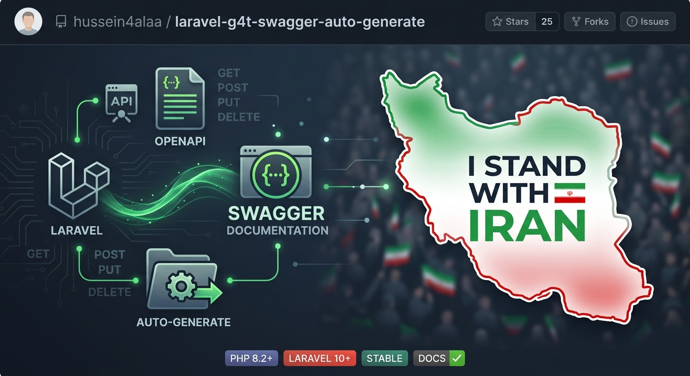
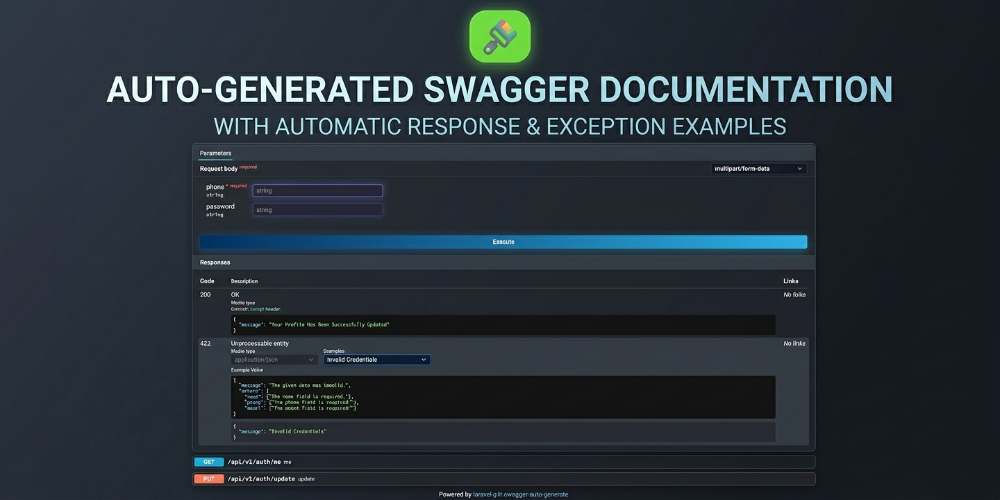

# Swagger Laravel Autogenerate Package

The Swagger Laravel Autogenerate Package automatically generates OpenAPI (Swagger) documentation for your Laravel APIs from route definitions, validation rules, and optional controller inference—so you spend less time maintaining specs by hand.

<p align="center">
  
</p>


## Features

- **Mock workflow (experimental):** optional `swagger:mock-server`.
- **Cached spec:** `swagger:cache` and `make:swagger`.
- Generates OpenAPI **3.x** JSON from your registered routes (URI, methods, middleware, tags, etc.).
- **FormRequest** rules drive request schemas and query/path parameters where applicable.
- Optional **inferred response examples** from controllers (`infer_response_examples`): literals, `JsonResource::collection` / `::make` / `new Resource`, `response()->json(...)`, and more (see `ResponseExampleExtractor`).
- Optional **inferred error examples** (`infer_error_response_examples`): `response()->json([...], status)`, `abort()`, validation-style **422** when rules warrant it.
- **Faster JSON endpoint**: when `load_from_json` is `false`, the package can serve `public/{cached_spec_path}` if it exists (`use_cached_spec_when_present`, default `true`), otherwise builds from routes on each request.
- **storage/swagger/…** JSON files can override per-route response examples when enabled in config.
- Route macros: `->description()`, `->summary()`, `->hiddenDoc()`; controller `#[SwaggerSection('…')]`.
- Optional **basic auth** for the documentation UI (configurable).


<p align="center">
  
</p>


## Installation

```bash
composer require g4t/swagger
```

## Usage

#### Video walkthrough

[](https://www.youtube.com/watch?v=bI1BY9tAwOw)

1. Publish the configuration file:

   ```bash
   php artisan vendor:publish --provider "G4T\Swagger\SwaggerServiceProvider"
   ```

2. Adjust **`config/swagger.php`** (title, URL prefix, versions, inference flags, **`cached_spec_path`** / **`use_cached_spec_when_present`**, etc.).

3. Open the UI at **`/{swagger.url}`** (default: `/swagger/documentation`), e.g. `https://your-app.test/swagger/documentation`.

4. The **issues** page route is configured via `swagger.issues_url` (default: `/swagger/issues`).

5. Describe a route:

   ```php
   Route::get('user', [UserController::class, 'index'])->description('Get list of users with pagination.');
   ```

6. Short summary on the route:

   ```php
   Route::get('user', [UserController::class, 'index'])->summary('get users.');
   ```

7. Hide an endpoint from the docs:

   ```php
   Route::get('user', [UserController::class, 'index'])->hiddenDoc();
   ```

8. Controller section description:

   ```php
   <?php

   namespace App\Http\Controllers;

   use G4T\Swagger\Attributes\SwaggerSection;

   #[SwaggerSection('everything about your users')]
   class UserController extends Controller
   {
       // ...
   }
   ```

9. Documentation **basic auth** (`config/swagger.php`):

   ```php
   "enable_auth" => false,
   "username" => "admin",
   "password" => "pass",
   "sesson_ttl" => 100000,
   ```

## Artisan commands

| Command | What it does |
|---------|----------------|
| `make:swagger` | Writes OpenAPI JSON to **`public/{cached_spec_path}`** (default `doc.json`). Legacy name; same destination as `swagger:cache`. |
| `swagger:cache` | Regenerates and writes the cached spec to **`public/{cached_spec_path}`**, or **`swagger:cache --clear`** removes that file. Skips generation when `swagger.enable` is false (clear still works). |
| `swagger:mock-server` | Optional G4T mock workflow (experimental). |

```bash
php artisan make:swagger
php artisan swagger:cache
php artisan swagger:cache --clear
php artisan swagger:mock-server
```

---

## Mock server (experimental)

G4T provides an **optional** command that connects your **auto-generated API documentation** to a **hosted mock experience** run by G4T. The goal is to make it easier to explore or demo your API surface while you build—without you having to host that side yourself.

> **Experimental:** This feature is **under testing**. It may change, pause, or evolve without much advance notice. Do not rely on it for business-critical production paths yet.

Run:

```bash
php artisan swagger:mock-server
```

---
   

## OpenAPI export & caching

### `make:swagger`

Regenerates the spec from the current application routes and writes:

- **Path:** `public_path(config('swagger.cached_spec_path', 'doc.json'))`
- **Encoding:** `JSON_PRETTY_PRINT | JSON_UNESCAPED_UNICODE`

```bash
php artisan make:swagger
```

Run after changing routes, controllers, FormRequests, or resources when you rely on a cached file for the JSON endpoint.

### `swagger:cache`

Same write target and encoding as `make:swagger`, with an extra **clear** option:

```bash
php artisan swagger:cache
php artisan swagger:cache --clear
```

Use **`--clear`** to delete the cached file without regenerating. Regeneration requires **`swagger.enable`** to be true.

### JSON endpoint behavior

The **`/{swagger.url}/json`** response is resolved by `DocumentationController::resolveSwaggerSpecification()`:

| `load_from_json` | Behavior |
|------------------|----------|
| `true` | Only the file at `public/{cached_spec_path}` is used; missing/invalid file → empty array `[]`. |
| `false` | If `use_cached_spec_when_present` is `true` (default) **and** the file exists with valid JSON, that file is served; otherwise the spec is built live from routes. |

**Config / env** (defaults apply if keys are missing from an older published config):

- `cached_spec_path` — path under `public/` (default `doc.json`; env `SWAGGER_CACHED_SPEC_PATH`).
- `use_cached_spec_when_present` — default `true`; env `SWAGGER_USE_CACHED_SPEC=false` forces live generation without deleting the file.
- `load_from_json` — static-file-only mode (legacy).

## Suggestions

Feature requests: [Canny board](https://g4t.canny.io/).

## Contributing

Issues and pull requests are welcome on [GitHub](https://github.com/hussein4alaa/laravel-g4t-swagger-auto-generate).

## License

Open-source under the [MIT license](LICENSE.md).

## Credits

Maintained by [HusseinAlaa](https://www.linkedin.com/in/hussein4alaa/).

## Additional resources

- [OpenAPI / Swagger](https://swagger.io/docs/)
- [Laravel documentation](https://laravel.com/docs)
- [Package repository](https://github.com/hussein4alaa/laravel-g4t-swagger-auto-generate)
